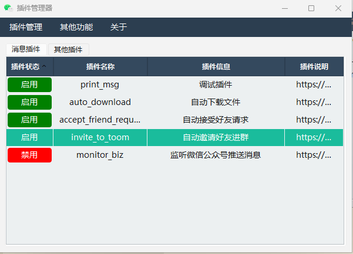
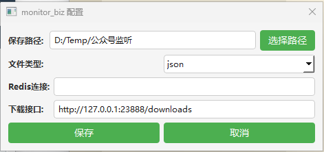
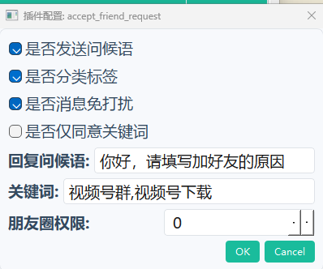
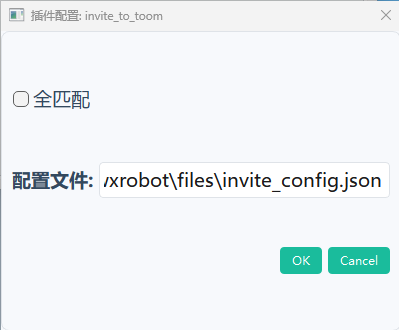

## 项目介绍

这个是之前pywxrobot的更新维护版(免费使用)，不再使用aardio，而是使用pyside6做界面，可以更好的加载python脚本。

因为很多功能我用不到，所以大概率只会添加一些常用功能和我会用到的功能，文章介绍的话请看：https://mp.weixin.qq.com/mp/appmsgalbum?__biz=MzU0OTkwODU2MA==&action=getalbum&album_id=3904319476392476689#wechat_redirect



#### 功能列表

- [x] 监控公众号推送
- [x] 自动同意好友请求
- [x] 关键词自动邀请进群
- [ ] 单向好友检测
- [ ] 自动下载文件、图片和视频
- [ ] 对接知识库做智能客服
- [ ] 对接腾讯元宝AI
- [ ] 用AI总结最近的群聊天消息，告诉我有没有我关心的内容
- [ ] 还没想到

## 使用介绍

#### 监听公众号推送



配置需要保存的方式，当公众号发文时就会推送到对应的配置。

具体介绍请看: https://mp.weixin.qq.com/s/S3nFVPHAhxn23MQb_Mct-Q

#### 自动同意好友请求



- 是否发送问候语：如果对方请求没有携带任何消息，会将下面的回复问候语发送给他
- 是否分类标签：根据他的好友申请携带的内容讲他归类到某个标签下，例如他发的视频号群就把他打上视频号群的标签
- 是否消息免打扰：同意好友请求后消息免打扰
- 是否仅同意关键词：只有命中下面的关键词规则才会自动同意好友的请求，不然会回复问候语(如果设置)
- 朋友圈权限: 不让他看 1 不看他 2 不让他看|不看他 3 仅聊天 8 

#### 关键词自动邀请进群



全匹配是指发送的文字要跟设置的规则一模一样，也就是==。不勾选则是半匹配，只需要发送的文章里包含设置的规则即可。

配置文件里是个json格式的字典，键为群名称，值为触发的条件，例如
```
{
    "测试群聊1": ["进群测试"]
}
```