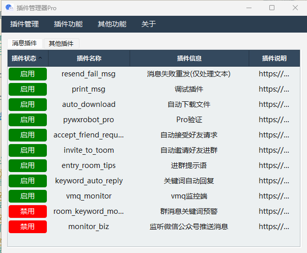

## 项目介绍

这个是之前pywxrobot的更新维护版(目前有两个版本：免费版和pro版,区别只是插件不一样)，不再使用aardio，而是使用pyside6做界面，可以更好的加载python脚本。

如果有需要采集公众号历史/搜一搜/视频号等数据可以看收费的接口: https://v2i7lj8pzi.apifox.cn

#### 下载地址

国内网盘下载地址：[https://www.123912.com/s/ihEKVv-CW8x?](https://www.123912.com/s/ihEKVv-CW8x) 提取码:9ceo

#### 更新频率

因为很多功能我用不到，所以大概率只会添加一些常用功能和我会用到的功能，文章介绍的话请看：`https://mp.weixin.qq.com/mp/appmsgalbum?__biz=MzU0OTkwODU2MA==&action=getalbum&album_id=3904319476392476689#wechat_redirect`

#### 功能列表

免费插件

- [x] [监控公众号推送](https://mp.weixin.qq.com/s/YEG0DrQjVqBjeXvKnNqlAw)
- [x] [自动同意好友请求](https://mp.weixin.qq.com/s/Ky62rpaw-T72O6gL3M8Zrw)
- [x] [关键词自动邀请进群](https://mp.weixin.qq.com/s/Ky62rpaw-T72O6gL3M8Zrw)
- [x] [自动下载文件、图片和视频](https://mp.weixin.qq.com/s/mZvxw1rTzjPzgcRPETtS_w)
- [x] [关键词自动回复](https://mp.weixin.qq.com/s/oJ8COdZiKJSG0_hrVtOqqA)
- [x] [带撤回提示的防撤回](https://mp.weixin.qq.com/s/y8bV-AFSpVOYZC5N8ElpcA)
- [x] [公众号历史文章采集](https://mp.weixin.qq.com/s/JiaIxZ6yWGVraV_vYLkoDA)
- [x] 检测单个好友

以下是收费插件

- [x] [v免签监控端](https://mp.weixin.qq.com/s/cK71s92cUAtYeJKZ_5yzIw)
- [x] [公众号历史远程接口](https://mp.weixin.qq.com/s/AfB-riuJu59f4bmpJW07xg)
- [x] [批量检测单向好友](https://mp.weixin.qq.com/s/hVoCH9A1s-xmWHU-CydwJQ)
- [x] 群消息关键词预警
- [x] 进群提示语
- [x] 导出联系人列表(好友、群和公众号)
- [x] 导出群成员列表

以下是待更新插件

- [ ] 对接知识库做智能客服
- [ ] 对接腾讯元宝AI
- [ ] 用AI总结最近的群聊天消息，告诉我有没有我关心的内容
- [ ] 还没想到

## 使用介绍

#### 准备工作

- 3.9.12.37版本的绿色版微信，官方下载地址: `http://dldir1.qq.com/weixin/Windows/WeChat_3.9.12_update37.zip`，也可以在上面的网盘里下载。
- 监听程序，看上面的网盘

#### 使用方法

1. 先启动并登录上面下载的`3.9.12.37`版本微信
2. 然后打开软件按提示操作

